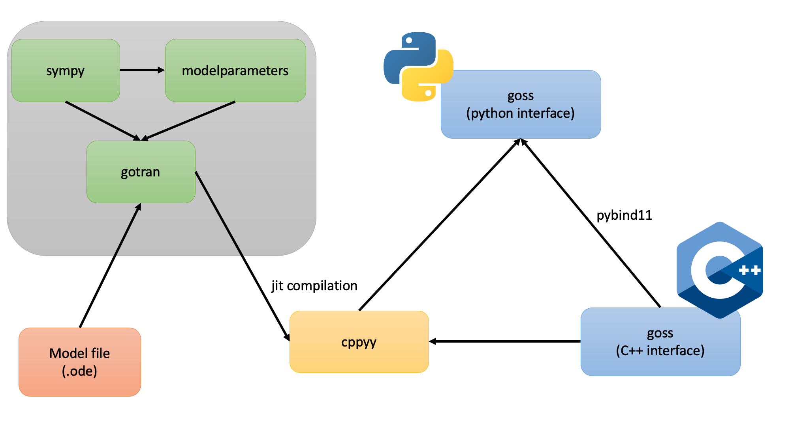

---
jupyter:
  celltoolbar: Slideshow
  jupytext:
    cell_metadata_filter: all
    cell_metadata_json: true
    formats: md
    notebook_metadata_filter: all,-language_info,-jupytext.text_representation.jupytext_version
    text_representation:
      extension: .md
      format_name: markdown
      format_version: '1.2'
  kernelspec:
    display_name: Python 3
    language: python
    name: python3
  rise:
    scroll: true
    center: false
    footer: <h3>GOSS - General ODE System Solver</h3>
    header: <h3>Henrik Finsberg - Computational Physiology meeting 27.04.2022</h3>
---

<!-- #region {"slideshow": {"slide_type": "slide"}} -->
# GOSS - General ODE System Solver

Henrik Finsberg

Computational Physiology meeting 27.04.2022

---
<!-- #endregion -->


<!-- #region {"slideshow": {"slide_type": "slide"}} -->
## Outline

- What is `goss`
- Basic usage (as an ODE solver)
- Advanced usage (solving several ODEs simultaneously)
- Components in `goss`
- Software development

---
<!-- #endregion -->


<!-- #region {"slideshow": {"slide_type": "slide"}} -->
`goss` is a library for solving system of ordinary differential equations

$$
\frac{d \mathbf{x}}{d t} = f(\mathbf{x}, t; \mathbf{p})
$$

where
- $\mathbf{x}$ is a vector of state variables
- $t$ is the time
- $\mathbf{p}$ is a vector of parameters
- $f$ is a function describing the evolution of the system

Install with
```
python -m pip install pygoss
```
(you don't need to run `CMake` or `make`, but you need to have `boost` installed)

---
<!-- #endregion -->


<!-- #region {"slideshow": {"slide_type": "slide"}} -->
## Example the Lorentz attractor


\begin{align*}
\frac{dx}{dt} &= \sigma (y - x) \\
\frac{dy}{dt} &= x (\rho  - z) - y \\
\frac{dz}{dt} &= x y - \beta z
\end{align*}

with
- $\mathbf{x} = (x, y, z)$
- $\mathbf{p} = (\sigma, \rho, \beta)$

---
<!-- #endregion -->

<!-- #region {"slideshow": {"slide_type": "slide"}} -->
## Example the Lorentz attractor

- $\mathbf{x}_0 = (1.0, 2.0, 3.05)$
- $\mathbf{p} = (12.0, 21.0, 2.4)$


<!-- #endregion -->


<!-- #region {"slideshow": {"slide_type": "slide"}} -->
## Defining your ODE in a `gotran` .ode file called `lorentz.ode`

```
parameters(
sigma=12.0,
rho=21.0,
beta=2.4
)

states(
x=1.0,
y=2.0,
z=3.05
)

dx_dt = sigma * (y - x)
dy_dt = x * (rho - z) - y
dz_dt = x * y - beta * z
```

---
<!-- #endregion -->


<!-- #region {"slideshow": {"slide_type": "slide"}} -->
## Load file in gotran

```python
from gotran import load_ode
lorentz = load_ode("lorentz.ode")
```

<!-- #endregion -->
<!-- #region {"slideshow": {"slide_type": "fragment"}} -->


Next we jit-compile the ODE into `goss`


```python
import goss
ode = goss.ParameterizedODE(lorentz)
```

<!-- #endregion -->
<!-- #region {"slideshow": {"slide_type": "fragment"}} -->

We can update the parameters using the `set_parameter` method


```python
ode.set_parameter("sigma", 10.0)
ode.set_parameter("rho", 28.0)
ode.set_parameter("beta", 8 / 3)
```


---
<!-- #endregion -->

<!-- #region {"slideshow": {"slide_type": "slide"}} -->
## Solve the ODE

We can now instantiate the solver and select the time steps


```python
solver = goss.solvers.RKF32(ode)
t = np.linspace(0, 100, 10001)
```

And solve the system

```python
u = solver.solve(t)
```

<!-- #endregion -->
<!-- #region {"slideshow": {"slide_type": "fragment"}} -->

We can also provide different initial conditions to the solver


```python
ic = np.array([0.0, 1.0, 1.05])
u = solver.solve(t, y0=ic)
```

---
<!-- #endregion -->


<!-- #region {"slideshow": {"slide_type": "slide"}} -->

## Comparison with Scipy and Scipy + Numba


---
<!-- #endregion -->


<!-- #region {"slideshow": {"slide_type": "slide"}} -->
## Solving the Tentusscher model

1. Model is available at [CellML](https://models.physiomeproject.org/workspace/tentusscher_panfilov_2006)

<!-- #endregion -->
<!-- #region {"slideshow": {"slide_type": "fragment"}} -->

2. Download model and convert
   ```
   git clone https://models.physiomeproject.org/workspace/tentusscher_panfilov_2006
   cd tentusscher_panfilov_2006
   ```

<!-- #endregion -->
<!-- #region {"slideshow": {"slide_type": "fragment"}} -->

3. Convert `.cellml` file to `.ode`
   ```
   python -m gotran cellml2gotran ten_tusscher_model_2006_IK1Ko_M_units.cellml
   ```

---
<!-- #endregion -->


<!-- #region {"slideshow": {"slide_type": "slide"}} -->
## Use command line interface for solving the Tentusscher model

```
goss run --help
```

Example

```
goss run -T 1000 --solver GRL1 -dt 0.01 --plot-y V --plot-y Ca_i tentusscher_panfilov_2006_M_cell.ode
```


---
<!-- #endregion -->

<!-- #region {"slideshow": {"slide_type": "slide"}} -->

## Comparison with Scipy and Scipy + Numba


---
<!-- #endregion -->

<!-- #region {"slideshow": {"slide_type": "slide"}} -->
## Command line interface

Built on [`click`](https://click.palletsprojects.com), [`rich`](https://github.com/Textualize/rich) and [`pydantic`](https://pydantic-docs.helpmanual.io)


---
<!-- #endregion -->

<!-- #region {"slideshow": {"slide_type": "slide"}} -->
## Solving the Tentusscher model for different parameters

Simulate a drug that blocks one or two channels in the cells.
We will block the CaL- and the Kr-channel with 0%, 20% and 40%

```python
field_parameters = ["g_CaL", "g_Kr"]
```

<!-- #endregion -->
<!-- #region {"slideshow": {"slide_type": "fragment"}} -->

We want to keep track of the voltage and intracellular calcium for these all the different parameter sets

```python
field_state_names = ["V", "Ca_i"]
```

<!-- #endregion -->
<!-- #region {"slideshow": {"slide_type": "fragment"}} -->

We supply these additional arguments to the `ParameterizedODE` class

```python
ode = goss.ParameterizedODE(
    load_ode("tentusscher_panfilov_2006_M_cell.ode"),
    field_states=field_state_names,
    field_parameters=field_parameters,
)
```


---
<!-- #endregion -->


<!-- #region {"slideshow": {"slide_type": "slide"}} -->
## Solving the Tentusscher model for different parameters

We use the first order generalized rush larsen scheme and set an internal step size of 0.01

```python
solver = goss.solvers.GRL1()
solver.internal_time_step = 0.01
```

<!-- #endregion -->
<!-- #region {"slideshow": {"slide_type": "fragment"}} -->

We will run 9 different parameter sets so we set the number of nodes to 9 and instantiate the `ODESystemSolver`

```python
num_nodes = 9
system = goss.ODESystemSolver(num_nodes, solver, ode)
```

---
<!-- #endregion -->


<!-- #region {"slideshow": {"slide_type": "slide"}} -->
## Solving the Tentusscher model for different parameters

Now, let us pick three block factors (1 representing baseline)

```python
block_factors = np.array([1, 0.8, 0.6])
```

<!-- #endregion -->
<!-- #region {"slideshow": {"slide_type": "fragment"}} -->

and update the field parameters


```python
field_parameters = system.field_parameters
# Block only CaL
field_parameters[:3, 0] *= block_factors
# Block only Kr
field_parameters[3:6, 1] *= block_factors
# Block both
field_parameters[6:9, 0] *= block_factors
field_parameters[6:9, 1] *= block_factors
```

---
<!-- #endregion -->


<!-- #region {"slideshow": {"slide_type": "slide"}} -->
## Solving the Tentusscher model for different parameters

Let us fist run the forward model for 50 000 ms

```python
T = 50_000
system.forward(0, T)
```

<!-- #endregion -->
<!-- #region {"slideshow": {"slide_type": "fragment"}} -->

And the run it for 1000 ms where we keep track of the field states

```python
tstop = 1000.0
dt = 1.0
time_stamps = np.arange(T, T + tstop, dt)
field_states = system.solve(time_stamps)
```

---
<!-- #endregion -->

<!-- #region {"slideshow": {"slide_type": "slide"}} -->
## Solving the Tentusscher model for different parameters

Note that calls to `system.forward` and `sytem.solve` runs in parallel using OpenMP


---
<!-- #endregion -->

<!-- #region {"slideshow": {"slide_type": "slide"}} -->
## Using `goss` with `cbcbeat` to solve the bi- or monodomain equations


```python
from cbcbeat.gossplittingsolver import GOSSplittingSolver

heart = cbcbeat.CardiacModel(mesh, time, M_i, M_e, cellmodel, stimulus)
solver = GOSSplittingSolver(heart)
# Traditional way
# solver = cbcbeat.SplittingSolver(heart)
```

Thanks to Cécile

<!-- #endregion -->

<!-- #region {"slideshow": {"slide_type": "fragment"}} -->

Our benchmarks shows that the `GOSSplittingSolver` is about 10% faster than the traditional `PointIntegralSolver`, but profiling remains to be done


---
<!-- #endregion -->


<!-- #endregion -->

<!-- #region {"slideshow": {"slide_type": "slide"}} -->
## Components used by `goss`



---
<!-- #endregion -->

<!-- #region {"slideshow": {"slide_type": "slide"}} -->
## Software development

- Local development
  - pre-commit hooks
- Testing
  - python
  - C++
  - Continuos integration
  - pre-commit.ci
- Documentation
- Continuos deployment on new tag
  - Publishing to pypi
  - Publishing docker image

---
<!-- #endregion -->


<!-- #region {"slideshow": {"slide_type": "slide"}} -->
## Pre-commit hooks will run every time you commit

- A good way to make sure you are not committing "bad code"
  - Code that doesn't follow the coding style
- If you are working with others then you will force everyone to use the same code style
  - That way you will not reformat all the code in every commit (for example if one is using tabs and the other is using spaces for indentation)


---
<!-- #endregion -->

<!-- #region {"slideshow": {"slide_type": "slide"}} -->
## Testing (C++)

- There is a test suite for the C++ code that uses Google test
- Written by Johan Hake (the original creator of `goss`)


---
<!-- #endregion -->


<!-- #region {"slideshow": {"slide_type": "slide"}} -->
## Testing (Python)

- Python code is tested using `pytest`
- Test coverage is about 95%


---
<!-- #endregion -->

<!-- #region {"slideshow": {"slide_type": "slide"}} -->

## All tests run in Continuous Integration (CI) using GitHub Actions


---
<!-- #endregion -->

<!-- #region {"slideshow": {"slide_type": "slide"}} -->

## Pre-commit hooks are also run on every push to the repo

- Using <https://pre-commit.ci>


---
<!-- #endregion -->


<!-- #region {"slideshow": {"slide_type": "slide"}} -->

## Documentation is hosted on GitHub pages

- Rebuilds documentation at every push to the repo
- <https://computationalphysiology.github.io/goss>


---
<!-- #endregion -->

<!-- #region {"slideshow": {"slide_type": "slide"}} -->

## You can also find this presentation in the documentation


---
<!-- #endregion -->


<!-- #region {"slideshow": {"slide_type": "slide"}} -->

## When a new tag is pushed, a new version is built and uploaded to pypi


---
<!-- #endregion -->


<!-- #region {"slideshow": {"slide_type": "slide"}} -->

## We also build a new Docker image when a new tag is pushed


---
<!-- #endregion -->


<!-- #region {"slideshow": {"slide_type": "slide"}} -->

## Check it out!

We need users!

<https://github.com/ComputationalPhysiology/goss>

---
<!-- #endregion -->
