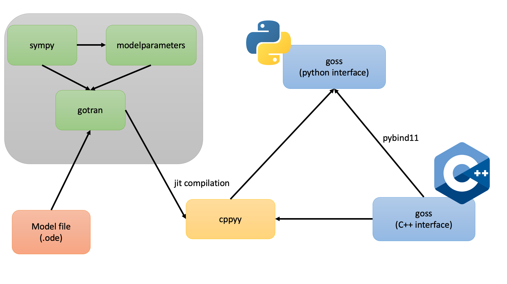

# Structure of `goss`

`goss` is primarily written in `C++` but contains a simpler python interface.

The bindings between python and C++ uses [pybind11](https://pybind11.readthedocs.io/en/stable/) and all the bindings are found in the file [python/wrapper.cpp](https://github.com/ComputationalPhysiology/goss/blob/main/python/wrapper.cpp).

The python package is built using [scikit-build](https://scikit-build.readthedocs.io/en/latest/index.html) which is a build system especially suited for python code with C++ extensions.

The ODEs needs to be defined in a `.ode` file known as a `gotran` format. To use this ODE in `goss` we jit compile this ODE into a C++ extension using a library called `cppyy`

